# Architecture diagram sources

Mermaid sources. C4 views use flowcharts with actor/system/container/component labels to avoid dependence on renderer-specific C4 extensions. Reference and production topologies are different views of the same component contracts.

## 1. C4 System Context

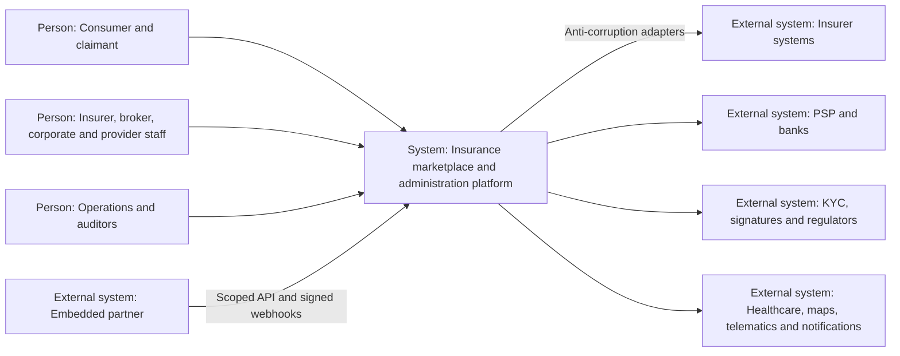

## 2. C4 Container

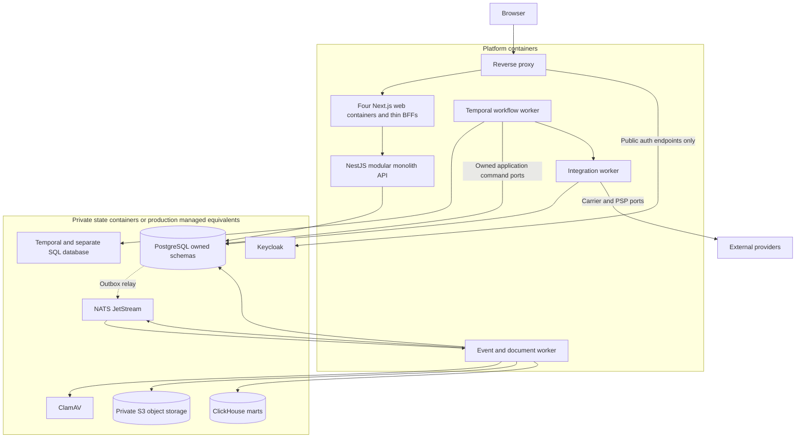

## 3. C4 Component

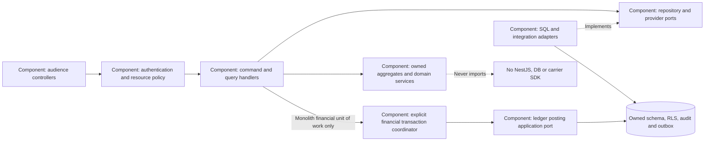

## 4. Tenant Model

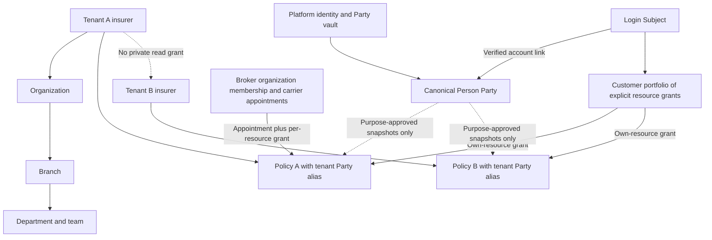

## 5. Domain Map

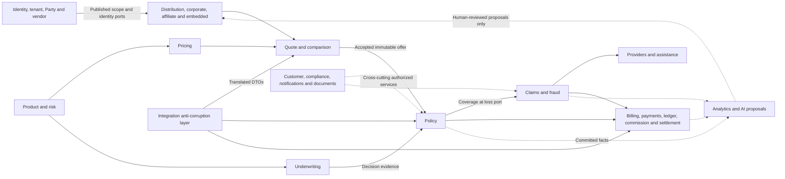

## 6. Quote Sequence

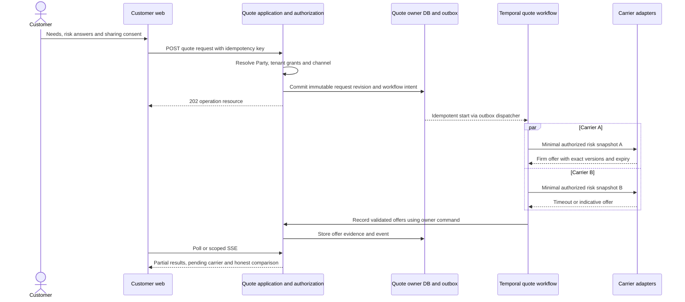

## 7. Underwriting Sequence

```mermaid
sequenceDiagram
  participant WF as Purchase workflow
  participant UW as Underwriting owner
  participant Rules as Pinned rules runtime
  participant Docs as Document owner
  actor Underwriter
  actor Approver
  WF->>UW: Open case with immutable risk and product versions
  UW->>Rules: Evaluate normalized evidence
  Rules-->>UW: Accept, decline or refer with trace
  alt Refer or additional evidence
    UW->>Docs: Create purpose-limited evidence task
    Docs-->>UW: Scanned verified evidence reference
    Underwriter->>UW: Propose reasoned decision with version
    UW->>UW: Validate assignment and authority, bind decision hash
    Approver->>UW: Independent approve if required
    UW->>UW: Revalidate hash, current grants and authority
  end
  UW-->>WF: Durable decision event plus evidence/validity reference
  Note over UW,WF: Risk change invalidates clearance; no hidden override
```

## 8. Purchase and Policy Issuance

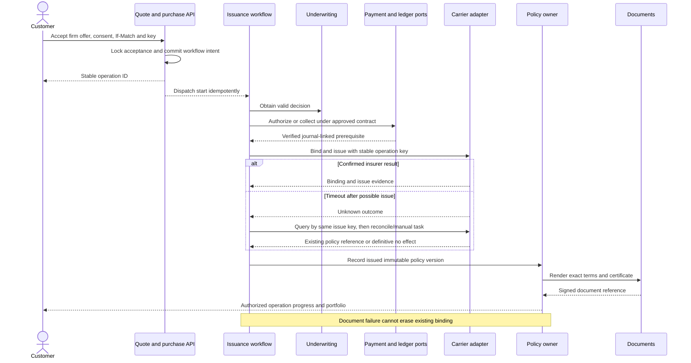

## 9. Claim Sequence

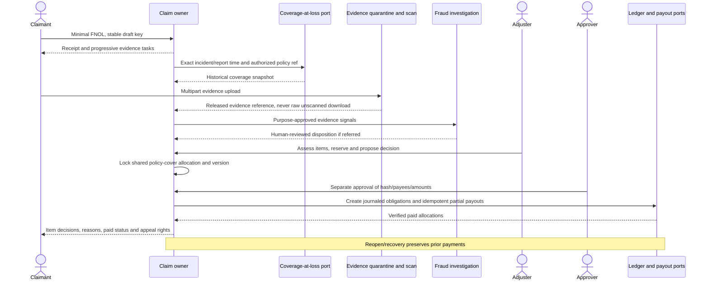

## 10. Payment Sequence

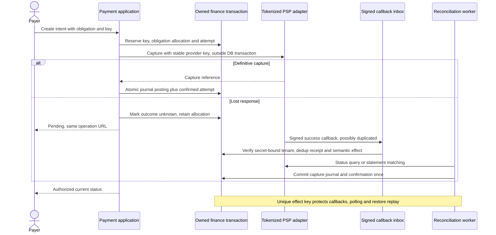

## 11. Settlement Sequence

```mermaid
sequenceDiagram
  actor Preparer
  actor Approver
  participant Set as Settlement owner
  participant Ledger as Ledger port
  participant WF as Settlement workflow
  participant Bank as Payout adapter
  Preparer->>Set: Prepare period with eligible obligations
  Set->>Ledger: Reconcile balances and allocate lines under lock
  Set-->>Approver: Immutable statement and payee/amount/version hash
  Approver->>Set: Independent step-up approval
  Set->>WF: Commit durable batch execution intent
  loop Each unpaid permitted line
    WF->>Set: Persist payout attempt and lock allocation
    WF->>Bank: Stable per-line payout key
    alt Verified success
      Bank-->>WF: Payout proof
      WF->>Set: Atomic finalize line plus ledger journal through ports
    else Unknown outcome
      WF->>Set: Hold line pending status/reconciliation
    end
  end
  WF->>Set: Complete only after all lines resolved and reconciled
  Set-->>Preparer: Final or partial statement; successful lines unchanged
```

## 12. Renewal Sequence

```mermaid
sequenceDiagram
  participant Clock as Durable term timer
  participant WF as Renewal workflow
  participant Quote as Quote and rating
  participant UW as Underwriting
  participant Notify as Notice orchestration
  actor Customer
  participant Pay as Payment and ledger
  participant Policy as Policy owner
  Clock->>WF: Start unique prior-term renewal cycle
  WF->>Quote: Fresh product/rating versions and eligible risk
  WF->>UW: Re-underwrite where required
  WF->>Notify: Jurisdiction notice, offer and consent/mandate task
  Notify-->>Customer: Transparent renewal total and terms
  Customer->>WF: Consent or valid lawful auto-renew mandate signal
  WF->>Pay: Collect under new cycle key
  alt Prerequisites confirmed
    WF->>Policy: Bind/issue new term and link prior term
    Policy-->>Customer: New-term documents
  else Definitive payment failure or refusal
    WF->>Notify: Retry/grace/non-renewal notice per versioned rule
  end
  Note over WF,Policy: Prior term expires independently; never rewrite its rules
```

## 13. Integration Architecture

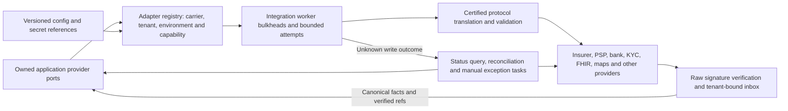

## 14. Event Architecture

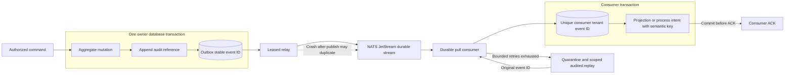

## 15. Docker Architecture

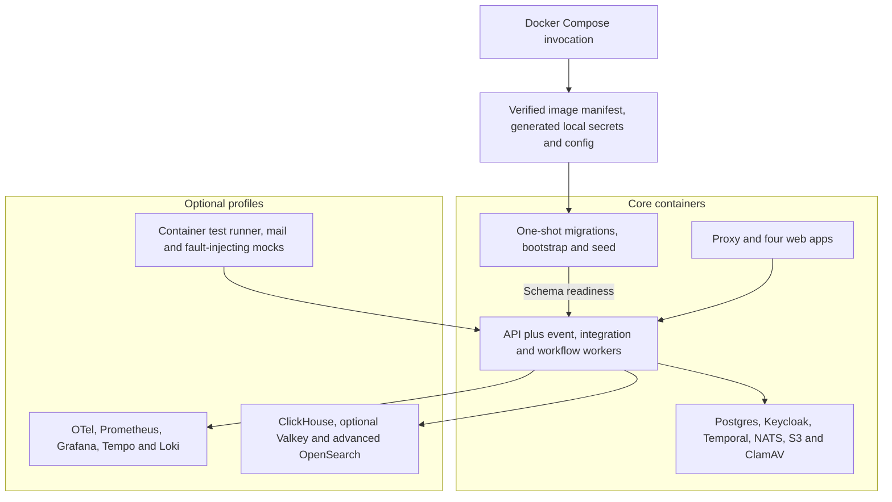

## 16. Security Trust Boundaries

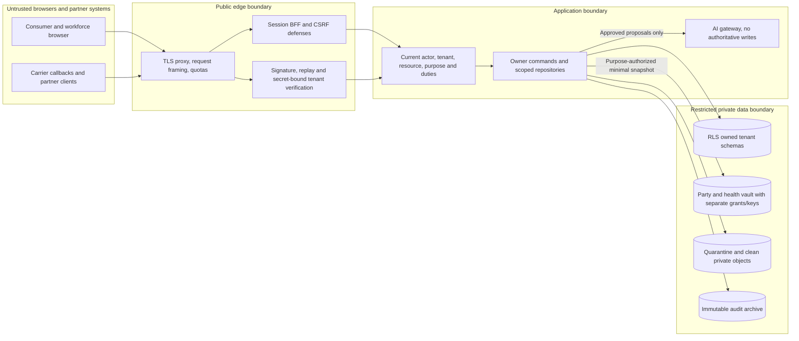

## 17. Deployment Topology

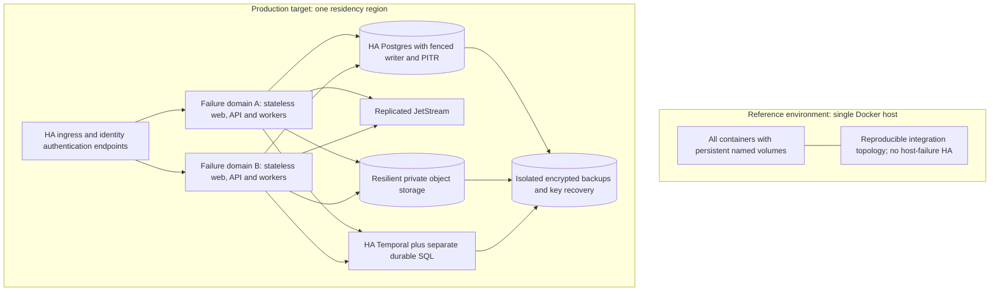

## 18. ER Models

Owned schema groups shown separately. Cross-context links are published immutable references/snapshots, not permission to join or mutate another owner's private tables.

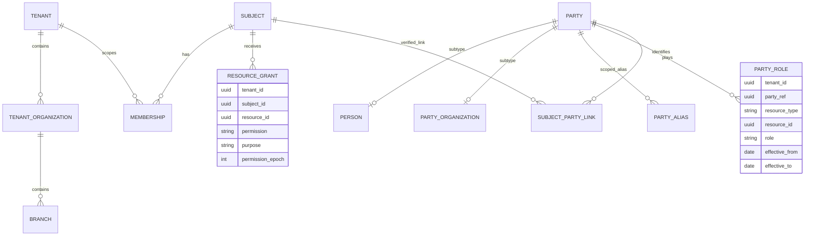

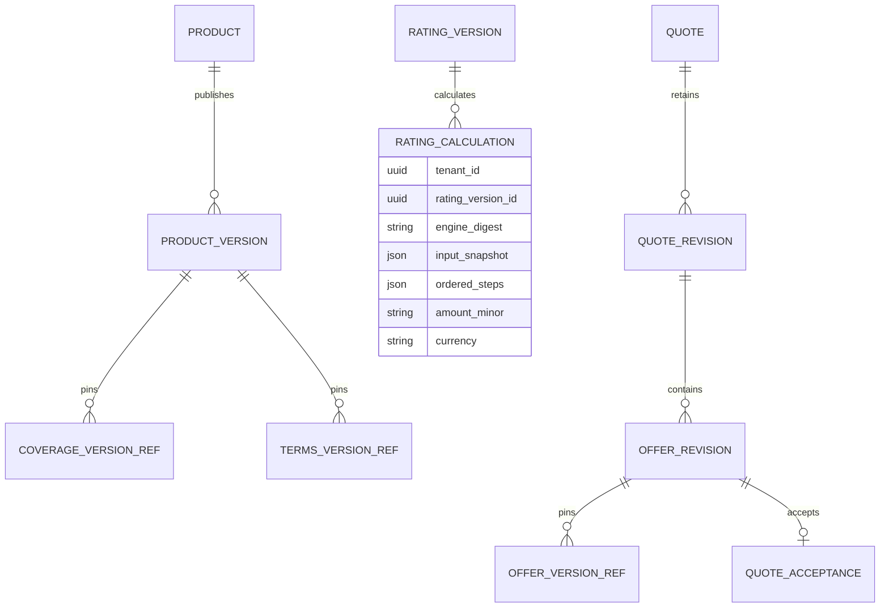

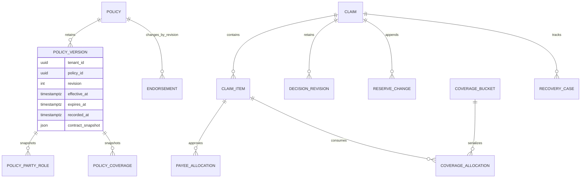

```mermaid
erDiagram
  LEDGER_BOOK ||--o{ LEDGER_ACCOUNT : contains
  LEDGER_BOOK ||--o{ JOURNAL_ENTRY : posts
  JOURNAL_ENTRY ||--|{ POSTING : balances
  LEDGER_ACCOUNT ||--o{ POSTING : debits_or_credits
  JOURNAL_ENTRY ||--o{ JOURNAL_REVERSAL_REF : reversed_by
  PAYMENT_INTENT ||--o{ PAYMENT_ATTEMPT : attempts
  PAYMENT_INTENT ||--o{ REFUND : linked_aggregate
  PAYMENT_ATTEMPT ||--o{ FINANCIAL_EFFECT_REF : journals
  SETTLEMENT ||--o{ SETTLEMENT_LINE : allocates
  SETTLEMENT_LINE ||--o{ PAYOUT_ATTEMPT : pays
  RECONCILIATION ||--o{ RECONCILIATION_MATCH : matches
  POSTING {
    uuid tenant_id
    uuid book_id
    uuid journal_id
    uuid account_id
    string currency
    string amount_minor
    string debit_or_credit
  }
  JOURNAL_ENTRY {
    uuid tenant_id
    uuid book_id
    uuid id
    string source_effect_key
    date accounting_date
    timestamptz recorded_at
  }
```
